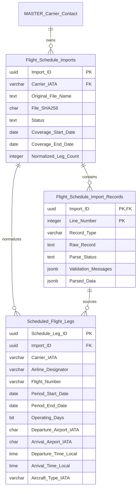
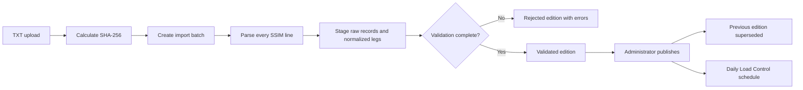

# Flight schedule storage — IATA SSIM Chapter 7

## Purpose

Store each carrier's uploaded schedule as a controlled edition and expose the published edition as a daily list of flights for Load Control.

The schedule database answers this operational question quickly:

> For carrier **XX**, service date **YYYY-MM-DD**, and optionally airport **AAA**, which flight legs must Load Control prepare?

## Data model

### `Flight_Schedule_Imports`

One row represents one uploaded TXT file. It stores the file checksum, edition metadata, validation totals, coverage dates and publication state.

The carrier identity parsed from the file is stored separately as `Source_Carrier_IATA` and must match the carrier workspace selected for upload. A mismatch is rejected before any schedule lines are staged.

Allowed states:

1. `DRAFT` — file metadata exists but normalized data is not ready.
2. `VALIDATED` — every required record passed validation and at least one leg was produced.
3. `PUBLISHED` — the edition used by the daily Load Control query.
4. `REJECTED` — staging completed with one or more errors, or with no flight legs.
5. `SUPERSEDED` — a previously published edition retained for audit.

Only one edition can be `PUBLISHED` for a carrier. Publishing another validated edition atomically supersedes the current edition.

### `Flight_Schedule_Import_Records`

Every input line is retained exactly as supplied. This includes headers, trailers, unsupported optional records and invalid records. The table permits the parser to improve later without losing the original airline file.

Each line has:

- a parse status;
- validation messages;
- a JSON representation of recognized fields;
- the exact raw record, including its fixed-width padding.

### `Scheduled_Flight_Legs`

The operational projection of the SSIM file. It stores recurring legs using:

- validity start and end dates;
- a seven-bit Monday-to-Sunday operating pattern;
- local departure and arrival times;
- an arrival day offset;
- optional UTC offsets, terminals, aircraft type and configuration;
- the source line number for traceability.

This table is indexed by carrier, validity period, airport and flight number so the application does not have to parse a complete SSIM file when opening each day's workload.

## Import and publication flow

The database RPC contract is:

1. `create_ssim_schedule_import(...)` records file identity and returns `Import_ID`.
2. `stage_ssim_schedule_import(...)` replaces an unpublished batch's staged lines and legs, validates the complete payload, and returns totals.
3. `publish_ssim_schedule_import(...)` makes a fully validated edition operational.
4. `get_daily_flight_schedule(carrier, date, airport)` returns the flights to prepare.

Published and superseded source records and flight legs are immutable.

## Daily Load Control query

`get_daily_flight_schedule` selects the carrier's published edition and filters legs by:

- service date within the operating period;
- the ISO weekday bit, Monday through Sunday;
- optional departure or arrival airport.

It returns concrete local departure and arrival timestamps for the requested service date, together with flight identity, route, terminals, equipment and retained additional data. `Additional_Data` also carries `loadControlReady` and the resolved recurring Load Control parameters when configured.

The application can use this result to create a flight work item and then resolve the scheduled aircraft type or configuration against the carrier's configured fleet. Schedule data should identify the expected equipment; assigning a registration and operational changes belong to the later flight-operation layer.

## Load Control parameters

`Scheduled_Flight_Load_Control_Parameters` adds editable operational defaults to an immutable published flight leg:

- the configured aircraft subtype;
- crew and pantry codes from that aircraft's E2 data;
- Standard, Flight Variation or Actual passenger weights;
- Standard, Flight Variation or Actual baggage weights;
- the selected passenger and baggage variation codes where applicable;
- operational remarks.

The schedule screen shows every published recurring leg and its readiness. Values are validated against the carrier's configured aircraft, crew codes, pantry codes and B3 flight variations. When a replacement schedule is published, parameters are copied to matching flight legs using flight identity, itinerary variation, leg sequence, route and aircraft type.

## Manual schedules

A carrier without an SSIM source can create a `MANUAL` schedule edition. Manual entry captures a flight number of up to four characters: numeric, or numeric with a final letter such as `401A` or `350B`. Leading zeroes are preserved. It also captures itinerary variation, service type, operating period, weekdays and planned aircraft type/configuration. The user can add up to 20 connected route segments before saving. The system assigns consecutive leg numbers, carries each arrival airport into the next departure field and saves the entire itinerary in one database transaction. Each segment is retained as a synthetic audited source record and normalized through the same `Scheduled_Flight_Legs` table.

Manual entry uses authoritative reference choices rather than free text:

- `MASTER_Flight_Service_Types` supplies the one-character service code, application, type of operation and user-facing description. The current 23 active values come from the supplied IATA SSIM Manual Appendix C extract, `SSIM Service Types.xlsx`.
- `MASTER_Airports` supplies IATA and optional ICAO codes, airport/city/country labels and an IANA time-zone identifier. IANA zones such as `Asia/Manila` are stored instead of a fixed UTC offset because the applicable offset can change with the service date and daylight-saving rules.
- carrier `Basic_Aircraft_Data` supplies the selectable type and subtype;
- carrier D9 `Aircraft_Configurations` supplies the dependent cabin-configuration choices.

The selected departure and arrival IANA zones are also retained in each manual leg's `Additional_Data` audit snapshot. The aircraft subtype is stored on the normalized leg so aircraft variants sharing the same IATA equipment code remain distinguishable.

### Schedule maintenance

The Flight Schedules workspace lists every schedule edition and provides a review view of its recurring legs. Unpublished manual editions can be extended, amended or reduced one flight leg at a time. Unpublished editions can be deleted in full. SSIM editions remain read-only because changes must originate from a corrected source file. Published editions are also immutable; a corrected edition is created and published as the replacement so the historical operating schedule remains auditable.

A manual edition remains editable while `DRAFT` or `VALIDATED`. After at least one valid leg is saved it can be published through the same controlled publication process as an SSIM edition.

## Security

The migration adds three carrier-scoped permissions:

| Permission | Purpose | Initial roles |
|---|---|---|
| `FLIGHT_SCHEDULE_VIEW` | Read schedules and the daily work list | Solution Administrator, Carrier Administrator, Configuration Editor |
| `FLIGHT_SCHEDULE_IMPORT` | Create and validate imports | Solution Administrator, Carrier Administrator |
| `FLIGHT_SCHEDULE_PUBLISH` | Make an edition operational | Solution Administrator, Carrier Administrator |

All three tables have row level security. Authenticated users receive direct read access only. Mutations pass through permission-checking database functions with fixed empty search paths.

When Load Control roles are introduced, grant `FLIGHT_SCHEDULE_VIEW` to those roles. Import and publication rights can remain restricted to schedule administrators.

## SSIM parser boundary

The database deliberately does not hard-code a particular SSIM manual edition's character offsets. The upload parser owns fixed-width Chapter 7 field extraction and converts supported schedule records into the staging contract. The database preserves every raw line and edition identifier so different airline producers and later SSIM editions remain auditable.

The first parser profile was verified on 7 October 2026 against `ZZ SSIM7.txt` (SHA-256 `557f736798e55a6847a43966c765c3dd2c62476375181d4d515f03dd1ba417a3`). The file contained 358 fixed-width records of exactly 200 characters: one Type 1 header, one Type 2 carrier record, 90 Type 3 flight legs, 241 Type 4 supplementary records, one Type 5 trailer and 24 zero-filled records. It normalized to 90 legs with no errors. In Types 3 and 4, columns 6–9 are the space-padded flight-number field, columns 10–11 are the itinerary variation identifier, and columns 12–13 are the leg sequence. Consequently the first value is flight `ZZ040`, variation `01`, leg `01`; it is not flight `ZZ0400`.

The implemented fixed-width mapping uses:

- Type 2 for source carrier, schedule coverage, file creation date and creator reference;
- Type 3 for flight identity, itinerary variation, leg sequence, service type, operating period, weekday pattern, route, local times, UTC offsets, terminals and aircraft type/configuration;
- Type 4 records attached to their matching Type 3 leg by carrier, flight number, itinerary variation, leg sequence and service type;
- Type 5 as the carrier/date trailer;
- zero-filled records retained as `SKIPPED` audit rows.

Unmapped Type 3 tail fields and all recognized Type 4 content remain in `Additional_Data`. This avoids assigning unsupported meanings to optional SSIM fields while retaining them for later parser extensions.

Continue verifying the parser against representative files from every airline producer to be supported. Test at least:

- headers and trailers;
- multi-leg flights and itinerary variation identifiers;
- flights crossing midnight;
- weekday and irregular operating patterns;
- terminals, UTC offsets and equipment/configuration codes;
- unsupported optional records;
- malformed lines and carrier/file mismatches.

## Future operational layer

This schema supplies planned schedule legs. A later operational flight table should reference `Schedule_Leg_ID` and service date, then hold mutable operational data such as registration, revised times, cancellation, crew/pantry codes, load status and loadsheet workflow state. That keeps the published SSIM edition immutable while allowing real-world changes to an individual flight.
